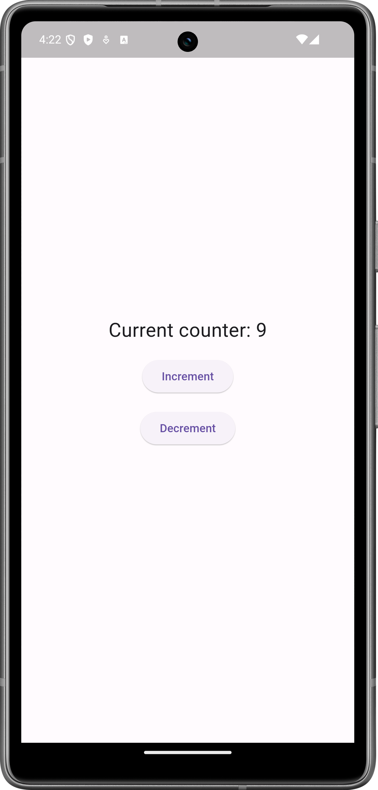

# bloc_example

A basic Flutter Project to demonstrate the use of BLoC pattern/library.



## `flutter_bloc` usage.

The project is using the `flutter_bloc` library to manage the state of a counter.
It is installed in the `pubspec.yaml` file.

```yaml
dependencies:
  # ...
  flutter_bloc: ^6.0.5
```

To use `flutter_bloc`, you need to create a `Cubit`. The `Cubit`s handles the state of the application.
For our simple counter app, we have a `CounterCubit` that extends `Cubit<int>`.

```dart
class CounterCubit extends Cubit<int> {
  CounterCubit() : super(0);

  void increment() => emit(state + 1);
  void decrement() => emit(state - 1);
}
```

The `CounterCubit` has two methods to increment and decrement the counter value.

To use our `CounterCubit`, we will need to create a `BlocProvider` in the widget tree.
This needs to be higher up in the widget tree, then we can use it. That is why I added it into the `main.dart`:

```dart
// ...

void main() => runApp(const App());

class App extends StatelessWidget {
  const App({super.key});

  @override
  Widget build(BuildContext context) {
    return MaterialApp(
      // ...
      home: BlocProvider(
        create: (context) => CounterCubit(),
        child: const IndexPage()
      ),
      // ...
    );
  }
}
```

To use the value of the counter, we can use the `BlocBuilder` widget. This widget listens to the state of the `CounterCubit` and rebuilds the widget tree when the state changes.
The following `Counter` widget will display the current counter value.

```dart
// ...
class Counter extends StatelessWidget {
  const Counter({super.key});

  @override
  Widget build(BuildContext context) {
    return BlocBuilder<CounterCubit, int>(
      builder: (context, state) => Text('Current counter: $state'),
    );
  }
}
// ...
```

To update the counter value, we can use the `context` to get the `CounterCubit` and call the `increment` and `decrement` methods.

```dart
// ...
void _increment(BuildContext context) => context.read<CounterCubit>().increment();
// ...
```

For more information on how to use `flutter_bloc`, check out the [documentation](https://bloclibrary.dev/), or look at the code.

## Talk about this project

This project was created as part of a educational talk in the lecture [Mobile Anwendungen (Mobile Application Development)](https://hm.pages.gitlab.lrz.de/muc.dai-organisation/gs/Mobile%20Anwendungen.html) at the [Hochschule München University of Applied Sciences](https://www.hm.edu/).