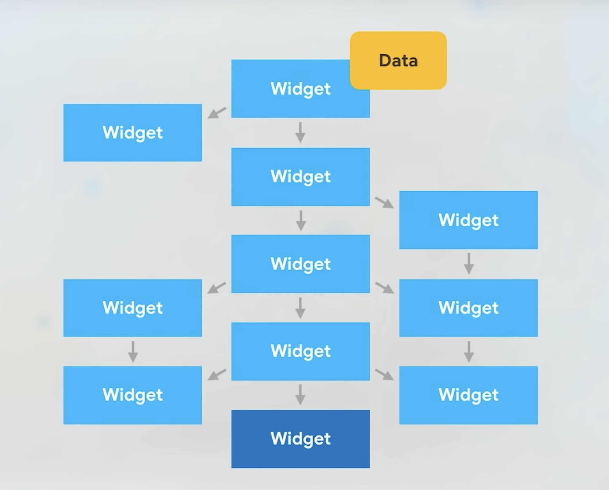
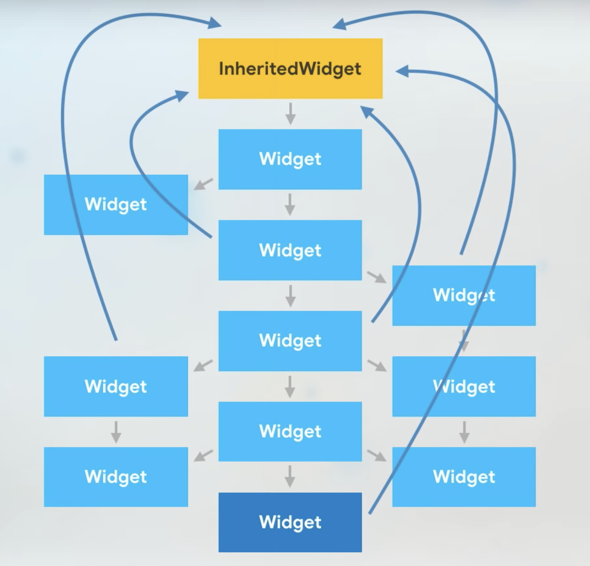

<style>
  img[alt~='center'] {
    display: block;
    margin-left: auto;
    margin-right: auto;
  }
</style>


# Bloc (`flutter_bloc`)

Presented by Paul Köhler

---

# Overview

- Introduction to `bloc`
- How does `bloc` work?
- Getting under the hood🔎
- Advanced `bloc`
- Summary

---

# `BLoC`?

- **B**usiness **Lo**gic **C**omponent
- Goal:
    - Simplify State Management
    - Providing a structured way for the flow of events and data

---

# What is `BLoC`?


---

# Why use `BLoC`?

- State management is hard.
- `bloc` is simple.

---

# But how?


- What is this `cubit` and how do I create one?

---

# How to define a `cubit`

```dart
class CounterCubit extends Cubit<int> {
  CounterCubit() : super(0);

  void increment() => emit(state + 1);
  void decrement() => emit(state - 1);
}
```

---

# Using a `cubit`: Initialization

```dart
class App extends StatelessWidget {
  const App({super.key});

  @override
  Widget build(BuildContext context) {
    return MaterialApp(
      home: BlocProvider(
        create: (context) => CounterCubit(),
        child: const IndexPage(),
      ),
      // ...
    );
  }
}
```

---

# Using a `cubit`: Getting the value

```dart
// ...
class Counter extends StatelessWidget {
  const Counter({super.key});

  @override
  Widget build(BuildContext context) {
    return BlocBuilder<CounterCubit, int>(
      builder: (context, state) => Text('Current counter: $state'),
    );
  }
}
// ...
```

---

# Using a `cubit`: Sending an event

```dart
// ...
void _increment(BuildContext context) => context.read<CounterCubit>().increment();
// ...
```

---

# How does it work?



---

# How does it work?



---

# Let's build our own 🚀

- State management libraries aren't black magic.

---

```dart
class SimpleState<T> {
  T _value;
  final StreamController<T> _streamController;

  SimpleState(value)
      : _value = value,
        _streamController = StreamController.broadcast() {
    _streamController.onListen = () => _streamController.add(_value);
  }

  emit(T value) {
    _value = value;
    _streamController.add(_value);
  }

  T get value => _value;

  Stream<T> get stream => _streamController.stream;
}
```

---

```dart
class SimpleStateProvider<T extends SimpleState> extends InheritedWidget {
  final T state;

  const SimpleStateProvider({
    super.key,
    required this.state,
    required super.child,
  });

  @override
  bool updateShouldNotify(covariant InheritedWidget oldWidget) {
    return false;
  }

  static SimpleStateProvider<T>? maybeOf<T extends SimpleState>(
      BuildContext context) {
    return context.dependOnInheritedWidgetOfExactType<SimpleStateProvider<T>>();
  }

  static SimpleStateProvider<T> of<T extends SimpleState>(
      BuildContext context) {
    final result = maybeOf<T>(context);
    assert(result != null, 'No StateProvider found in context');
    return result!;
  }
}
```

---

```dart
class SimpleStateBuilder<T extends SimpleState<S>, S> extends StatelessWidget {
  final Widget Function(BuildContext, S?) _builder;

  const SimpleStateBuilder({
    super.key,
    required Widget Function(BuildContext, S?) builder,
  }) : _builder = builder;

  @override
  Widget build(BuildContext context) {
    return StreamBuilder(
        stream: context.simpleState<T>().stream,
        builder: (context, snapshot) {
          return _builder(context, snapshot.data);
        });
  }
}
```

---

```dart
extension SimpleStateProviderExtension on BuildContext {
  T simpleState<T extends SimpleState>() =>
      SimpleStateProvider.of<T>(this).state;
}
```

---

# Let's try: Creating a `SimpleState`

```dart
class CounterSimpleState extends SimpleState<int> {
  CounterSimpleState() : super(0);

  void increment() => emit(value + 1);
  void decrement() => emit(value - 1);
}
```

---

# Let's try: Initialization

```dart
class App extends StatelessWidget {
  const App({super.key});

  final _counterState = CounterSimpleState()

  @override
  Widget build(BuildContext context) {
    return MaterialApp(
      home: SimpleStateProvider(
        state: _counterState,
        child: const IndexPage(),
      ),
      // ...
    );
  }
}
```

---

# Let's try: Getting the value

```dart
// ...
class Counter extends StatelessWidget {
  const Counter({super.key});

  @override
  Widget build(BuildContext context) {
    return SimpleStateBuilder<CounterSimpleState, int>(
      builder: (context, state) => Text('Current SimpleState counter: $state'),
    );
  }
}
// ...
```

---

# Let's try: Sending an event

```dart
// ...
void _increment(BuildContext context) => context.simpleState<CounterSimpleState>().increment();
// ...
```

---

# Advanced `bloc`


---

# Summary

- State management libraries aren't black magic.
- They do still make things easier though.
- Bloc is very mighty, but easy to use.

---

# Questions?

---

# References

The full source code is available on Github: [https://github.com/paulkoehlerdev/bloc_example](https://github.com/paulkoehlerdev/bloc_example)


The slides where created with [Marp](https://marp.app/)